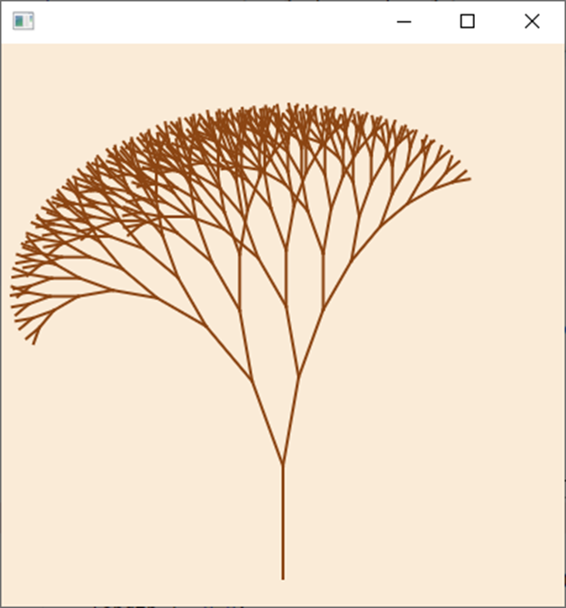
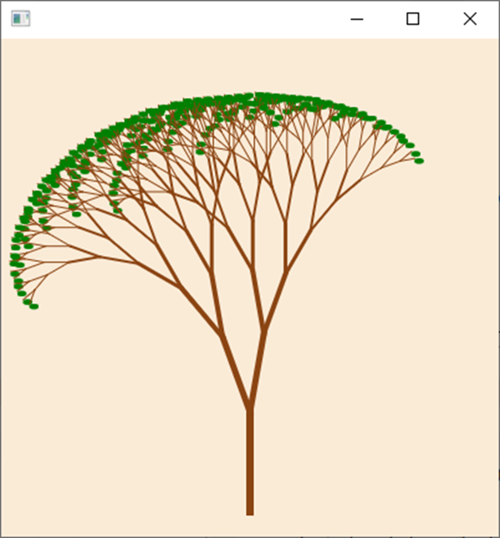

# Opgaver lektion 7

https://github.com/benn-christensen/Prog2Lektion07.git

## Opgave 1

Implementer metoden

    numberOfEvenNumbers(ArrayList<Integer> integers)  

ved hjælpe af en rekursiv hjælper metode. Metoden skal returnere
antallet af lige tal i integers.  

## Opgave 2

Et palindrom er en tekststreng der læses ens forfra og bagfra som f.eks ”ABBA”
og ”radar”.

Skriv en statisk rekursiv metode

    public static boolean palindrom(String tekst)

der returnerer true, hvis teksten er et palindrom og ellers false. Anvend hjælpe
metoder, så der ikke skal laves substrings. Det kan antages at teksten kun
indeholder bogstaver.

## Opgave 3

Collatz antagelsen er et matematisk problem der er defineret som.  

Givet et heltal n,  
 - hvis n er lige så dividere med 2. f(n) = n / 2
 - hvis n er ulige, så gang med 3 og læg 1 til. f(n) = 3 x 2 + 1

Hvor mange gange kan man bruge disse to regler før man ender med 1.

Eksempel:  

- n = 12, 12 er lige så vi dividerer med 2., 12/2 = 6
- n = 6 (lige), 6/2 = 3
- n = 3 (ulige), 3 x 3 + 1 = 10  
- n = 10 (lige), 10 / 2 = 5
- n = 5 (ulige), 3 x 5 + 1 = 16
- n = 16 (lige), 16 / 2 = 8
- n = 8 (lige), 8 / 2 = 4
- n = 4 (lige), 4 / 2 = 2
- n = 2 (lige), 2 / 2 = 1
- n = 1, vi er i mål. 

Vi skulle bruge en af de to regler 9 gange før vi endte i mål.

Skriv et rekursiv metode der returnerer, hvor mange gange vi har benyttet en af de to regler.

Kan vi være sikre på at vi altid ender med 1 for alle positive heltal?

https://youtu.be/094y1Z2wpJg?si=d26AMYoXLriLZSnl

## Opgave 4

Lav en metode der kan afgøre om et tal findes i et array af heltal (en søgning).  
Det kan antages at tallene i arrayet er sorteret i ikke aftagende orden og implementationen,
skal være baseret på binær søgning.

Implementationen skal anvende rekursion, idet den rekursive metode, skal være en hjælpe
metode, så der ikke skal laves kopier af dele af arrayet i de rekursive kald.

## Opgave 5

I den udleverede kode er er lavet et canvas med starten på træ. Lav rekursive kald i metoden
så du får tegnet et træ som i nedenstående eksempel. 

Hvordan dit træ kommer til at se ud,
afhænger af vinklen på de nye grene og længden af de nye grene.  

Math.cos og Math.sin bruger radianer. Følgende kode omregner fra grader til radianer.
2 * Math.PI * angle / 360

Hint: Din termineringsregel skal afhænge af længden af grenene.   

Ekstraopgave:

Tegn et træ hvor grenene har forskellig tykkelse og hvor der er blade på træet. Se
nedenstående.  

