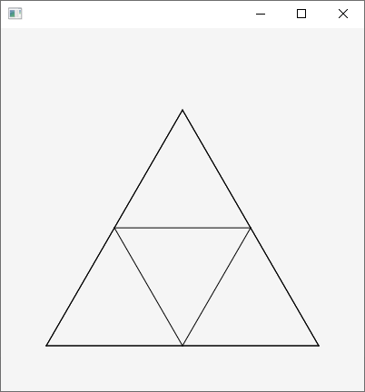
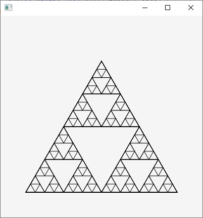

# Opgaver lektion 8

https://github.com/benn-christensen/Prog2Lektion08.git

## Opgave 1

Implementer sum metoden ved brug af del-løs-kombiner skabelonen.  

<b>Ekstra opgave:</b> Den abstrakte klasse Number har en abstrakt metode intValue, kan du bruge
Number klassen til at gøre sum metoden mere generel.

## Opgave 2

Brug del-løs-kombiner skabelonen til at tælle antallet af nul i en liste.

## Opgave 3

Implementer de tre metoder ved hjælp af del-løs-kombiner skabelonen.  

    int countStringsOfLength(ArrayList<String> strings, int length)

skal returnere antallet af strenge med længde length i listen.

    void printElementsOfLength(ArrayList<String> strings, int length)

skal udskrive de strenge der har længden length.

    ArrayList<String> elementsOfLength(ArrayList<String> strings, int length)

skal returnere en ny ArrayList med de elementer der har længden length.

<b>Ekstra opgave:</b> Hvis man gerne vil vide hvor mange elementer i listen der starter med
bogstavet ’M’, så kan man lave en ny metode. 
Men kan man tilføre en ekstra parameter til countStringsOfLenght, så man tæller antallet af elementer der opfylder en vilkårlig betingelse.

## Opgave 4

I denne opgave skal I implementere merge sort algoritmen.  
Start med at implementere flette delen af algoritmen, det er den totale fletning som vi lavede
på 1. semester. Så antal at de to parametre til metoder merge er sorterede lister.
Implementer derefter mergeSort metoden, ved brug af sublister. Du kan lave en subliste med   

    new ArrayList<>(list.subList(0, mid))

## Opgave 5

Figurerne viser to Sierpinski-trekanter; en af orden 1 og en af orden 5.  

En Sierpinski trekant af orden 0 er blot en ligesidet trekant. En Sierpinski trekant af orden 1,
er en Sierpinski trekant af orden 0, hvori der er tegnet ligesidede trekanter med halv
grundlinje i de tre hjørner. Se herover.  

En Sierpinski trekant af orden 2 er en Sierpinski trekant af orden 1, med 9 nye trekanter med
kvart grundlinie i de 3 hjørner af de 3 indre trekanter.

Den udleverede kode tegner et Sierpinski trekant af orden 0, en alm. Trekant     
metoden drawTriangle så I kan tegne en Sierpinski trekant af orden 5.
, udvid metoden drawTriangle så I kan tegne en Sierpinski trekant af orden 5.